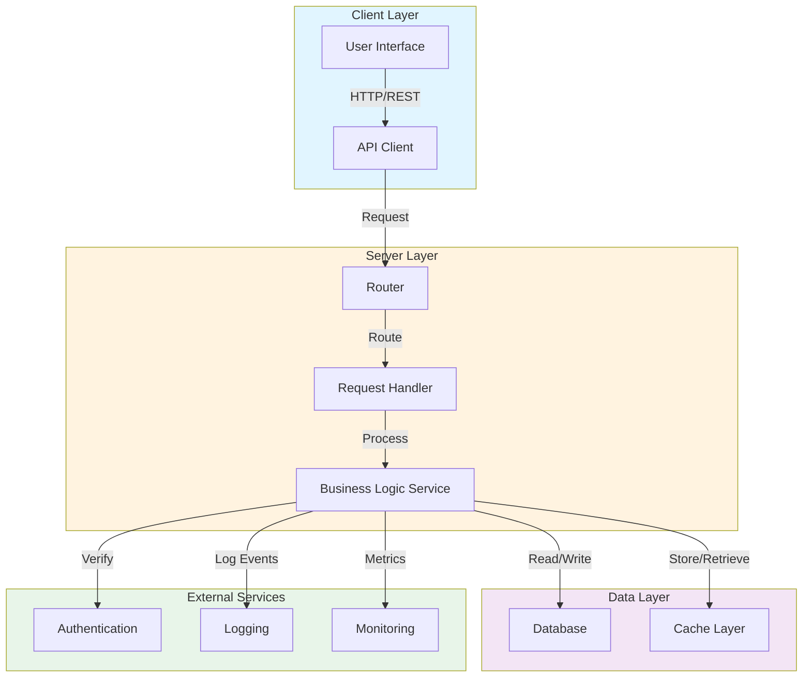

# Oxe Architecture Overview

## System Architecture

## Component Descriptions

### Client Layer
- **User Interface**: Frontend application for user interaction
- **API Client**: HTTP client for communicating with backend services

### Server Layer
- **Router**: Directs incoming requests to appropriate handlers
- **Request Handler**: Processes HTTP requests and manages request/response lifecycle
- **Business Logic Service**: Core application logic and business rules

### Data Layer
- **Database**: Primary persistent data storage
- **Cache Layer**: In-memory caching for performance optimization

### External Services
- **Authentication**: User identity and access control
- **Logging**: Event and error logging system
- **Monitoring**: Performance metrics and health monitoring

## Communication Flow

1. Client sends requests through the API Client
2. Router directs requests to appropriate handlers
3. Handler orchestrates the request processing
4. Service layer handles business logic
5. Data layer manages persistence and caching
6. External services provide cross-cutting concerns
7. Response flows back through the layers to the client
